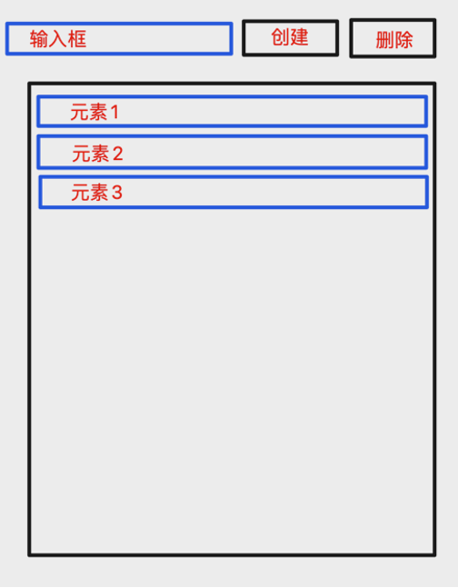

# DataReachable Website

<div align="center">
	
	<br/>
	<div style="margin:auto">
		<span style="font-size:200%">Front End Intern Test Project Demo</span>
	</div>
</div>

# Description

This is the Front End Intern Test Project, only for intern test purpose.

# Project Structure

## Overview

```
ProjectSample/ .................... Project Folder
├─ public/ ........................ Public Static Files Root Folder
│  ├─ favicon.ico ................. Project Favicon
│  ├─ icon.png .................... Project Icon
│  ├─ index.html .................. Project Production HTML File
│  └─ indexDev.html ............... Project Development HTML File
├─ src/ ........................... Project Root Folder
│  ├─ global.d.ts ................. Typescript Third-party Package Declaration File
│  ├─ index.tsx ................... Project Root File
│  ├─ Assets/ ..................... Project Public Components Root Folder
│  │  └─ images ................... Project Images Root Folder
│  ├─ Components/ ................. Project Public Components Root Folder
│  │  ├─ index.ts ................. Unified Export Project Public Components File
│  │  └─ PublicComponentA/ ........ Project Public Component A Folder
│  │     ├─ index.tsx ............. Project Public Component A Entry File
│  │     └─ style.scss ............ Project Public Component A Style File
│  ├─ Constant/ ................... Project Resuable Style Root Folder
│  │  └─ 'name'.scss .............. Resuable Style File
│  ├─ Locales/ .................... Project Multilingual Configuration Folder
│  │  ├─ Translations ............. Resuable Style File
│  │  │  ├─ en .................... English Translations Folder
│  │  │  │  └─ translation.json ... English Translations file
│  │  │  └─ cn .................... Chinese Translations Folder
│  │  │     └─ translation.json ... Chinese Translations file
│  │  └─ i18n.ts .................. Multilingual Configuration file
│  ├─ PageLayouts/ ................ Project Page Layout Root Folder
│  │  ├─ index.ts ................. Unified Export Project Layouts File
│  │  └─ LayoutA/ ................. Project Layout A Folder
│  │     ├─ index.tsx ............. Project Public Layout A Entry File
│  │     └─ style.scss ............ Project Public Layout A Style File
│  ├─ Pages/ ...................... Project Pages Root Folder
│  │  ├─ index.ts ................. Unified Export Project Pages File
│  │  └─ PageA/ ................... Project Page A Folder
│  │     ├─ index.tsx ............. Project Page A Entry File
│  │     ├─ style.scss ............ Project Page A style
│  │     └─ Components/ ........... Project Page A Private Components Folder
│  │        ├─ index.ts ........... Unified Export Project A Private Components File
│  │        └─ PrivateComponentA/ . Project Page A Private Component A Folder
│  │           ├─ index.tsx ....... Project Page A Private Component A Entry File
│  │           └─ style.scss ...... Project Page A Private Component A Style File
│  ├─ Route/ ...................... Route Root Folder
│  │  └─ index.tsx ................ Route Management Entry File
│  └─ Store/ ...................... Store Root Folder
│     ├─ rootReducer.ts ........... Root Reducer To Combine All Module Reducer
│     ├─ rootSaga.ts .............. Root Saga
│     ├─ rootStore.ts ............. Root Store
│     └─ moduleA/ ................. ModuleA Folder
│        ├─ actionTypes.ts ........ ModuleA Action Types File
│        ├─ actions.ts ............ ModuleA Actions File
│        ├─ reducer.ts ............ ModuleA Reducer File
│        └─ sagas.ts .............. ModuleA Asynchronous Request Function Management Saga File
├─ webpackConfig/ ................. Webpack Root Folder
│  ├─ webpack.common.js ........... Webpack General Configuration File
│  ├─ webpack.dev.js .............. Webpack Development Environment Packaging Configuration File
│  └─ webpack.prod.js ............. Webpack Production Environment Packaging Configuration File
├─ .babelrc ....................... Configure Presets And Plugins File
├─ .eslintignore .................. ESLint To Ignore Specific Files File
├─ .eslintrc.js ................... Typescript Syntax Detection Rules File
├─ .prettierrc.js ................. Code Formatting Style Rules File
├─ package.json ................... Project Configuration Information File
├─ postcss.config.js .............. Project Style Configuration File
└─ tsconfig.json .................. Typescript Compilation Rules File


```

# Usage

## Local Environment Requirement

This project requires React with minimal version of 16.13.0 and thus, should install essential NPM packages prior to usage.

The following procedure assumes the node and npm have already been installed and are accessible from the commandline. For installation of node and npm, see [install node and npm](https://www.npmjs.com/get-npm).

## Install All The Necessary Package To The Project

Run the following command to install the packages:

```javascript
npm install
```

## Setting Up ESLint and Prettier To Work With This Project

For a good developer experience, it is useful to set the editor to automatically run ESLint's automatic repair commands when saving files.
To open your user and workspace settings, follow the following method:

On Windows/Linux - File > Preferences > Settings > Extensions > Scroll down and find "Edit in settings.json"

On macOS - Code > Preferences > Settings > Extensions > Scroll down and find "Edit in settings.json"

You can also open the Settings editor from the Command Palette (⇧⌘P) with Preferences: Open Settings or use the keyboard shortcut (⌘,), or see [User and Workspace Settings](https://code.visualstudio.com/docs/getstarted/settings) to get more information.

Now, You should have an open file to execute it. If you don’t want to format the file manually every time, you can also format it when saving. Therefore, you need to open the settings/preferences of Visual Studio Code users in JSON format and configure the following:

```javascript
{
  "editor.codeActionsOnSave": {
    "source.fixAll.eslint": true
  },
  "editor.formatOnPaste": true,
  "editor.formatOnSave": true,
  "eslint.validate": [
    "javascript",
    "javascriptreact",
    "typescript"
  ],
}
```

## Run The Project Demo

Enter the following command to run the demo:

```javascript
npm run start
```

## Project Specification

This is very important !! Before you start coding, please read the [Porject Specification](https://docs.datareachable.net/) carefully.

## Project 1

- Project name: dataReachable official website
- Project time: 5 days
- Project requirements:\
  1. Throught github to clone the testing project repo to your local folder, and create a new branch which will be named like "internProject1/[your name]"
  2. Install scss package in your prject, and by using scss to develop your style
  3. According to the design to developer the page, those page will be responsive to three different screen size, which are desktop(1024px), ipad(768px) and phone(372px)
  4. When you complete the project, please push your code to the github and dispacth a new pull request to the master branch.

## Project 2

- Project name: to do list
- Project time: 2 days
- Project requirements:

  1. Through github to clone the testing project repo to your local folder, and create a new branch which will be named like "internProject2/[your name]"
  2. This project don't have any requirements about the style
  3. Add a new input
  4. Add tow buttons, one is "create", another is "delete"
  5. Add a list
  6. Click the input to input the value, then click the "create" button to add a new element to the list, this new element's value is equal to input value
  7. Select any element in the list, then click "delete" button to delete this element
  8. All the list data will be stored into Redux
  9. When you complete the project, please push your code to the github and dispacth a new pull request to the master branch.

- project demo

<div>
	
	<br/>
</div>
# internProject2
